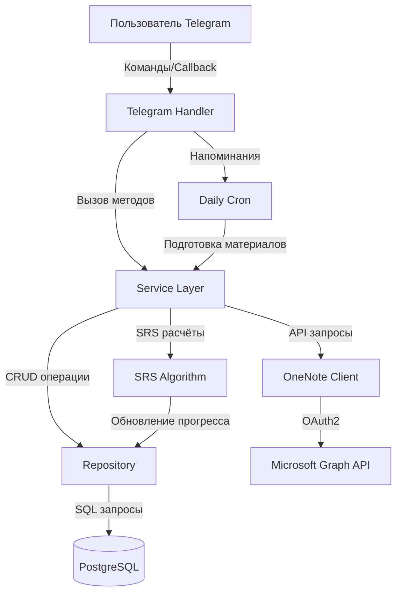
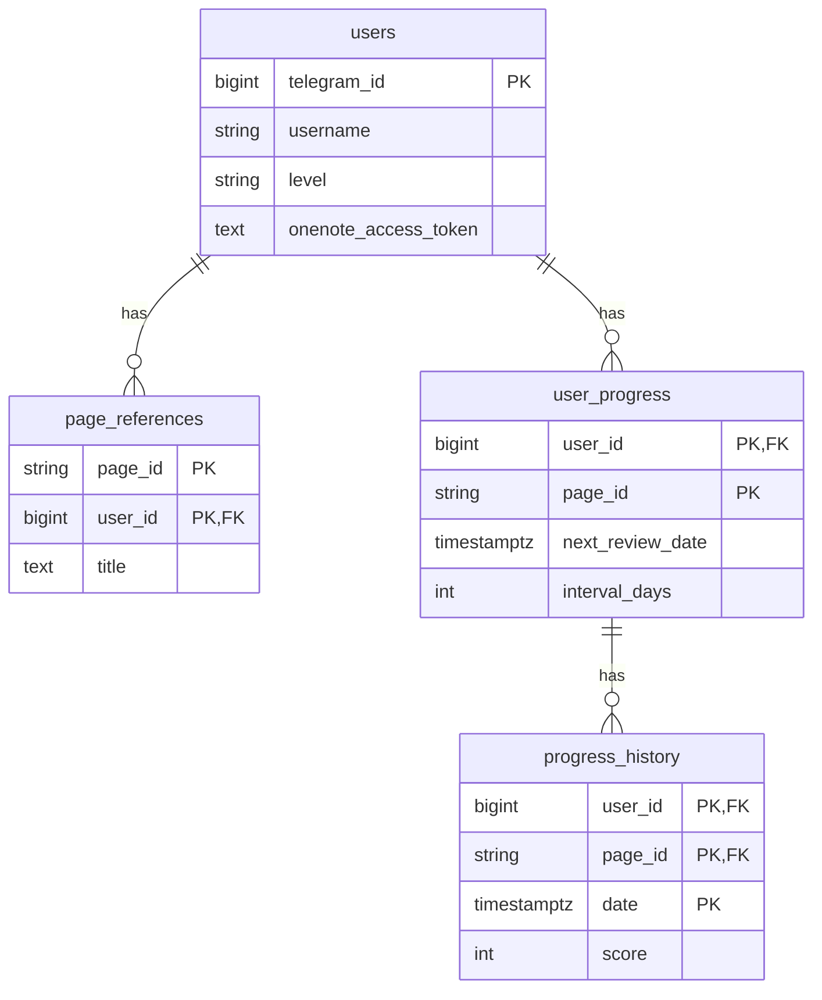
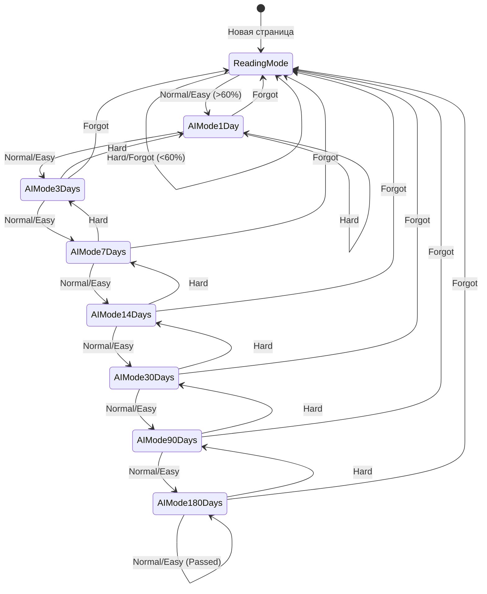
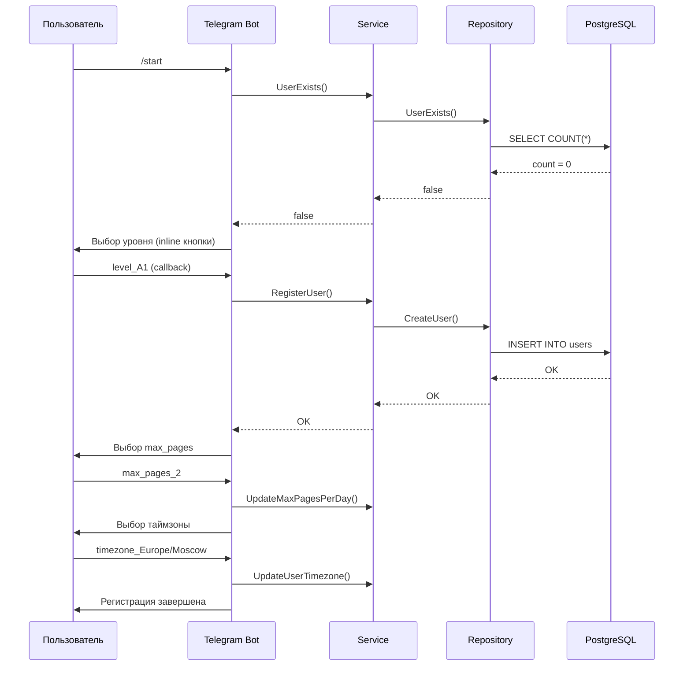
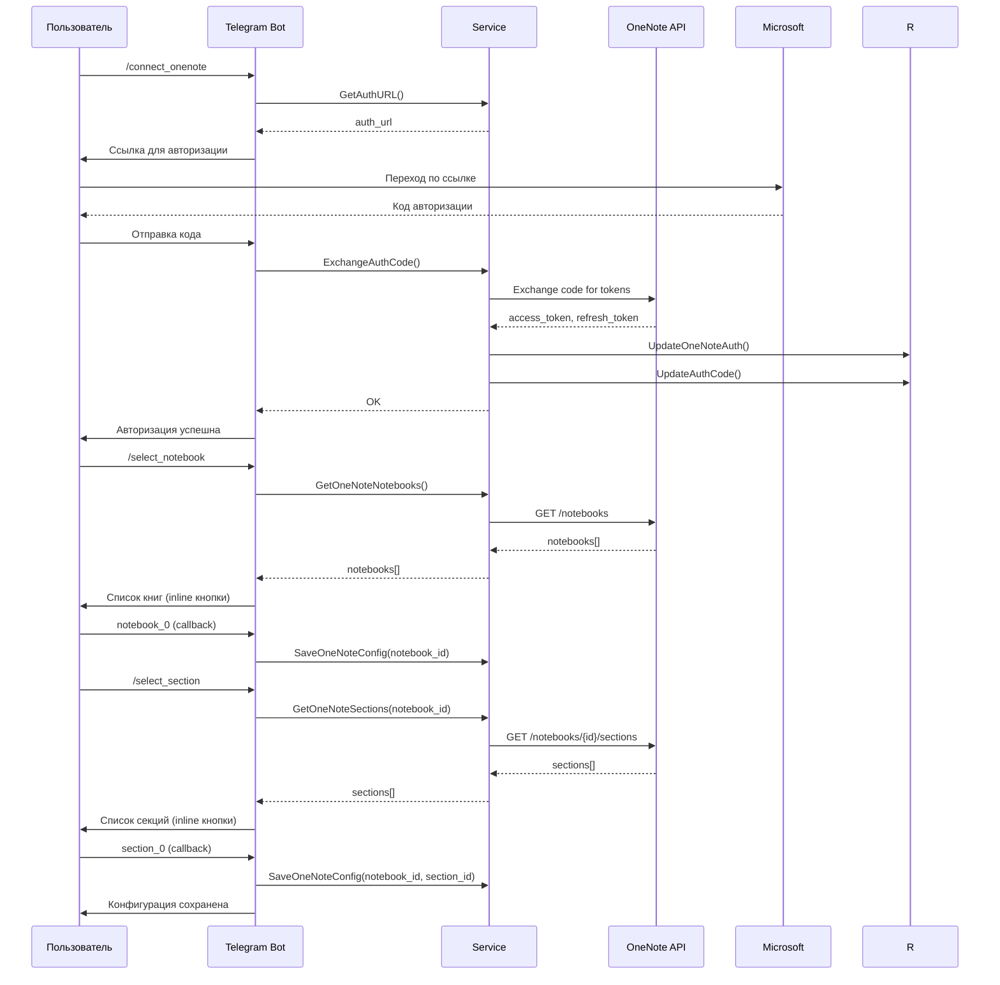
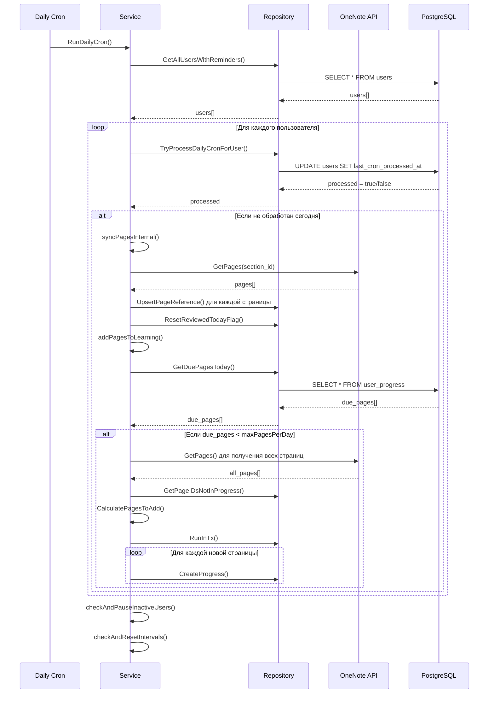
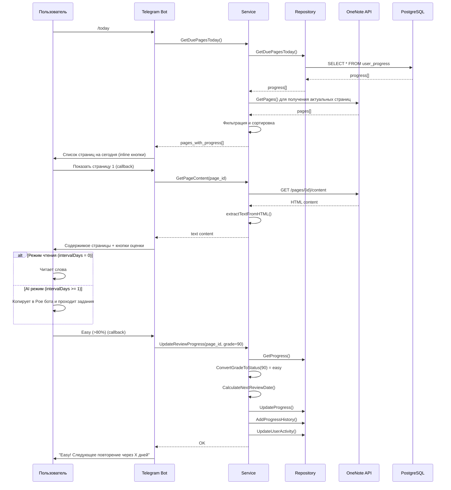
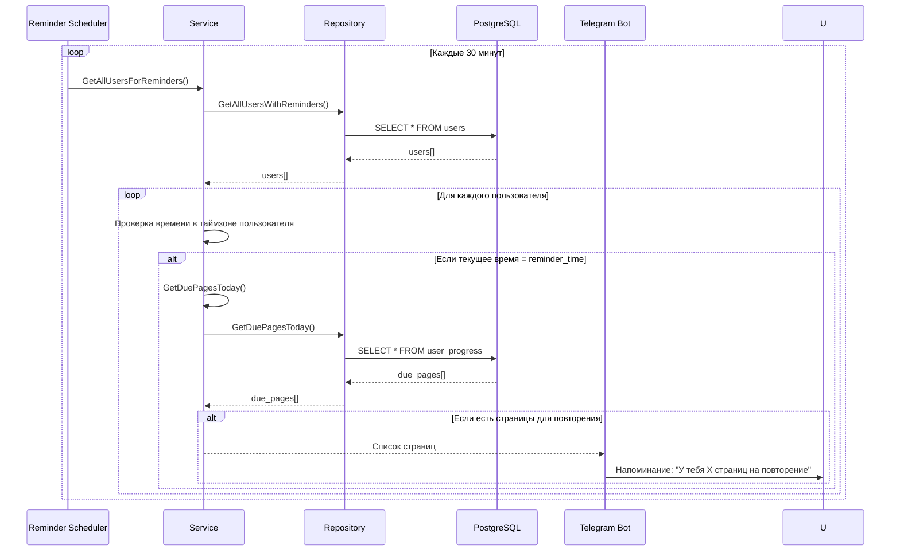

# Документация Master English SRS

## Содержание

1. [Обзор проекта](#1-обзор-проекта)
2. [Архитектура системы](#2-архитектура-системы)
3. [Компоненты системы](#3-компоненты-системы)
4. [База данных](#4-база-данных)
5. [Алгоритм SRS](#5-алгоритм-srs)
6. [Процессы работы](#6-процессы-работы)
7. [Конфигурация и развёртывание](#7-конфигурация-и-развёртывание)
8. [API и интеграции](#8-api-и-интеграции)
9. [Утилиты](#9-утилиты)

---

## 1. Обзор проекта

### Описание проекта

**Master English SRS** — это Telegram-бот для изучения английского языка, использующий систему интервальных повторений (Spaced Repetition System, SRS). Бот интегрируется с Microsoft OneNote для синхронизации учебных материалов и автоматически управляет процессом повторения страниц в соответствии с алгоритмом SRS.

### Основные функции и возможности

- **Регистрация пользователей** с выбором уровня владения языком (A1, A2, B1, B2, C1)
- **Интеграция с Microsoft OneNote** для получения учебных материалов
- **Система интервальных повторений (SRS)** с адаптивными интервалами
- **Два режима обучения**:
  - **Режим чтения** (первое знакомство с материалом)
  - **AI режим** (стандартные SRS интервалы)
- **Автоматическая подготовка материалов** каждый день
- **Напоминания** о необходимости повторения
- **Гибкая настройка** количества страниц в день (2-4)
- **Поддержка временных зон** для корректной работы расписания
- **Управление прогрессом** с отслеживанием истории повторений
- **Автоматическое управление неактивными пользователями** (пауза, сброс интервалов)

### Технологический стек

- **Язык программирования**: Go 1.25.3
- **База данных**: PostgreSQL 16
- **Telegram API**: go-telegram-bot-api/v5
- **ORM/Database**: 
  - sqlx для работы с БД
  - Squirrel для построения SQL запросов
  - pgx/v5 как драйвер PostgreSQL
- **Миграции**: goose/v3
- **OAuth2**: golang.org/x/oauth2 (Microsoft Azure AD)
- **HTTP клиент**: стандартная библиотека net/http
- **Логирование**: go.uber.org/zap
- **Конфигурация**: godotenv
- **Контейнеризация**: Docker, Docker Compose

---

## 2. Архитектура системы

### Общая архитектура

Проект следует архитектуре трёх слоёв (3-tier architecture):

```
┌─────────────────────────────────────────┐
│      Telegram Bot Handler               │
│   (internal/handler/telegram.go)        │
│  - Обработка команд                     │
│  - Callback handlers                    │
│  - Напоминания                          │
└──────────────┬──────────────────────────┘
               │
               ▼
┌─────────────────────────────────────────┐
│         Service Layer                   │
│    (internal/service/service.go)        │
│  - Бизнес-логика                        │
│  - Управление пользователями            │
│  - Интеграция с OneNote                 │
│  - SRS алгоритм                         │
└──────┬──────────────────────┬───────────┘
       │                      │
       ▼                      ▼
┌──────────────┐    ┌────────────────────┐
│  Repository  │    │   OneNote Client   │
│   Layer      │    │  (pkg/onenote/)    │
│              │    │  - OAuth2 Auth     │
│  - Users     │    │  - Graph API       │
│  - Pages     │    │  - Pages Content   │
│  - Progress  │    └────────────────────┘
└──────┬───────┘
       │
       ▼
┌─────────────────────────────────────────┐
│      PostgreSQL Database                │
│  - users                                 │
│  - page_references                       │
│  - user_progress                         │
│  - progress_history                      │
└─────────────────────────────────────────┘
```

### Диаграмма потока данных



### Описание слоёв

#### Handler Layer (Презентационный слой)
- **Назначение**: Взаимодействие с пользователем через Telegram Bot API
- **Ответственность**:
  - Приём и валидация команд от пользователей
  - Обработка callback-запросов от inline-кнопок
  - Форматирование и отправка сообщений
  - Запуск фоновых процессов (напоминания, cron)

#### Service Layer (Бизнес-логика)
- **Назначение**: Реализация бизнес-логики приложения
- **Ответственность**:
  - Управление жизненным циклом пользователей
  - Координация работы с OneNote API
  - Реализация алгоритма SRS
  - Подготовка и синхронизация материалов
  - Управление прогрессом обучения

#### Repository Layer (Слой данных)
- **Назначение**: Абстракция работы с базой данных
- **Ответственность**:
  - CRUD операции с пользователями
  - Управление страницами и их ссылками
  - Отслеживание прогресса обучения
  - Сохранение истории повторений
  - Транзакционная поддержка

#### Database Layer
- **Назначение**: Хранение данных
- **Ответственность**:
  - Персистентное хранение всех данных
  - Обеспечение целостности данных
  - Эффективные запросы через индексы

---

## 3. Компоненты системы

### 3.1. Telegram Bot Handler

**Файл**: `internal/handler/telegram.go`

#### Основные функции

Обработчик Telegram-бота реализует все взаимодействия с пользователями через Telegram Bot API.

##### Структура

```go
type TelegramHandler struct {
    api     *tgbotapi.BotAPI
    service models.Service
}
```

##### Обрабатываемые команды

| Команда | Описание | Функция обработки |
|---------|----------|-------------------|
| `/start` | Регистрация нового пользователя или приветствие | `handleStart()` |
| `/connect_onenote` | Получение ссылки для авторизации в OneNote | `handleConnectOneNote()` |
| `/select_notebook` | Выбор книги OneNote для синхронизации | `handleSelectNotebook()` |
| `/select_section` | Выбор секции OneNote | `handleSelectSection()` |
| `/today` | Получение списка страниц на повторение сегодня | `handleToday()` |
| `/pages` | Просмотр всех страниц в процессе изучения | `handlePages()` |
| `/set_max_pages <число>` | Установка максимального количества страниц в день | `handleSetMaxPages()` |
| `/get_max_pages` | Получение текущего лимита страниц | `handleGetMaxPages()` |
| `/prepare_materials` | Ручная подготовка материалов | `handlePrepareMaterials()` |
| `/set_timezone` | Установка временной зоны | `handleSetTimezone()` |
| `/help` | Справка по командам | `handleHelp()` |

##### Callback handlers

Обработка нажатий на inline-кнопки:

- `level_*` — выбор уровня языка при регистрации
- `notebook_*` — выбор книги OneNote
- `section_*` — выбор секции
- `show_*` — показ содержимого страницы
- `grade_*_*` — оценка результата повторения (80-100, 60-80, 40-60, 0-40)
- `skip_page` — пропуск страницы
- `skip_all` — пропуск всех страниц
- `start_today_yes/no` — решение о начале обучения сегодня
- `timezone_*` — выбор временной зоны
- `max_pages_*` — выбор лимита страниц

##### Система напоминаний

```go
func (h *TelegramHandler) startReminderScheduler()
```

- Запускается при старте бота
- Проверяет наличие страниц для повторения каждые 30 минут
- Отправляет напоминание в установленное пользователем время (по умолчанию 09:00)
- Учитывает временную зону пользователя

##### Ежедневный cron

```go
func (h *TelegramHandler) startDailyCron()
```

- Выполняется при старте и затем каждый час
- Вызывает `RunDailyCron()` из service layer
- Обеспечивает ежедневную подготовку материалов для всех пользователей

### 3.2. Service Layer

**Файл**: `internal/service/service.go`

#### Основные функции

Service Layer содержит всю бизнес-логику приложения.

##### Структура

```go
type Service struct {
    repo          models.Repository
    authService   *onenote.AuthService
    oneNoteClient *onenote.Client
}
```

##### Управление пользователями

**Регистрация пользователя**:
```go
func (s *Service) RegisterUser(ctx context.Context, telegramID int64, username, level string) error
```
- Создаёт нового пользователя в БД
- Устанавливает значения по умолчанию (timezone: UTC, maxPagesPerDay: 2, reminderTime: "09:00")

**Получение пользователя**:
```go
func (s *Service) GetUser(ctx context.Context, telegramID int64) (*models.User, error)
```

**Обновление уровня**:
```go
func (s *Service) UpdateUserLevel(ctx context.Context, telegramID int64, level string) error
```

##### Интеграция с OneNote

**Авторизация OAuth2**:
```go
func (s *Service) GetAuthURL(telegramID int64) string
func (s *Service) ExchangeAuthCode(ctx context.Context, telegramID int64, code string) error
```

**Управление токенами**:
```go
func (s *Service) getValidAccessToken(ctx context.Context, telegramID int64) (string, error)
```
- Автоматически обновляет access token при истечении
- Использует refresh token или auth code для обновления
- Возвращает `AuthRequiredError`, если требуется повторная авторизация

**Работа с OneNote API**:
```go
func (s *Service) GetOneNoteNotebooks(ctx context.Context, telegramID int64) ([]onenote.Notebook, error)
func (s *Service) GetOneNoteSections(ctx context.Context, telegramID int64, notebookID string) ([]onenote.Section, error)
func (s *Service) GetPageContent(ctx context.Context, telegramID int64, pageID string) (string, error)
```

Все методы используют `withAuthRetry()` для автоматической обработки ошибок авторизации с повторной попыткой после обновления токена.

##### Управление прогрессом обучения

**Получение страниц на повторение**:
```go
func (s *Service) GetDuePagesToday(ctx context.Context, telegramID int64) ([]*models.PageWithProgress, error)
```
- Возвращает страницы, для которых `next_review_date` наступил
- Фильтрует по временной зоне пользователя
- Исключает страницы с `*` в названии и без номера страницы
- Сортирует по номеру страницы и дате повторения

**Обновление прогресса после повторения**:
```go
func (s *Service) UpdateReviewProgress(ctx context.Context, telegramID int64, pageID string, grade int) error
```
- Конвертирует оценку (0-100) в статус SRS (forgot, hard, normal, easy)
- Вычисляет следующий интервал и дату повторения
- Обрабатывает переход из режима чтения (intervalDays = 0) в AI режим
- Обновляет историю прогресса
- Автоматически возобновляет пользователя, если он был приостановлен

**Подготовка материалов**:
```go
func (s *Service) PrepareMaterials(ctx context.Context, telegramID int64) error
```
- Синхронизирует страницы из OneNote
- Добавляет новые страницы в процесс обучения

**Добавление страниц в обучение**:
```go
func (s *Service) addPagesToLearning(ctx context.Context, telegramID int64) error
```
- Проверяет количество страниц на сегодня
- Вычисляет, сколько страниц нужно добавить (на основе maxPagesPerDay)
- Выбирает страницы без номера в названии и без `*`
- Добавляет их с начальной датой повторения (завтра, intervalDays = 0)

##### Ежедневный cron

```go
func (s *Service) RunDailyCron(ctx context.Context) error
```

Выполняет для каждого пользователя:
1. Проверку, был ли уже обработан сегодня (через `TryProcessDailyCronForUser`)
2. Синхронизацию страниц из OneNote
3. Сброс флага `reviewed_today`
4. Добавление новых страниц в обучение
5. Проверку неактивных пользователей (приостановка после недели без активности)
6. Сброс интервалов для неактивных более месяца

##### Управление неактивными пользователями

**Приостановка неактивных**:
```go
func (s *Service) checkAndPauseInactiveUsers(ctx context.Context) error
```
- Находит пользователей без активности неделю
- Приостанавливает, если количество страниц на сегодня достигло максимума

**Сброс интервалов**:
```go
func (s *Service) checkAndResetIntervals(ctx context.Context) error
```
- Находит пользователей без активности месяц
- Сбрасывает интервалы для непройденных страниц до 1 дня

### 3.3. Repository Layer

Repository Layer предоставляет абстракцию для работы с базой данных PostgreSQL.

#### Структура

```go
type Postgres struct {
    db   *sqlx.DB
    tx   *sqlx.Tx
    psql squirrel.StatementBuilderType
}
```

#### Компоненты

##### Users Repository (`internal/repository/users.go`)

**Операции с пользователями**:
- `CreateUser()` — создание пользователя
- `GetUser()` — получение пользователя по Telegram ID
- `UserExists()` — проверка существования
- `UpdateUserLevel()` — обновление уровня
- `UpdateOneNoteAuth()` — сохранение токенов OAuth
- `UpdateAuthCode()` — сохранение кода авторизации
- `UpdateOneNoteConfig()` — сохранение конфигурации (notebook, section)
- `UpdateMaxPagesPerDay()` — обновление лимита страниц
- `UpdateUserTimezone()` — обновление временной зоны
- `UpdateUserActivity()` — обновление даты последней активности
- `SetUserPaused()` — установка флага приостановки
- `GetAllUsersWithReminders()` — получение всех пользователей для напоминаний
- `GetUsersWithoutActivityAfter()` — поиск неактивных пользователей
- `TryProcessDailyCronForUser()` — атомарная проверка обработки cron (защита от дублирования)
- `UpdateLastCronProcessedAt()` — обновление времени последнего cron

##### Pages Repository (`internal/repository/pages.go`)

**Операции со страницами**:
- `CreatePageReference()` — создание ссылки на страницу
- `GetPageReference()` — получение ссылки
- `UpsertPageReference()` — создание или обновление ссылки
- `GetUserPagesInProgress()` — получение всех страниц пользователя
- `DeleteUserPages()` — удаление всех страниц пользователя

##### Progress Repository (`internal/repository/progress.go`)

**Операции с прогрессом**:
- `CreateProgress()` — создание записи прогресса
- `GetProgress()` — получение прогресса по странице
- `UpdateProgress()` — обновление прогресса
- `AddProgressHistory()` — добавление записи в историю
- `GetDuePagesToday()` — получение страниц для повторения сегодня
- `ProgressExists()` — проверка существования прогресса
- `GetAllProgressPageIDs()` — получение всех ID страниц в прогрессе
- `GetPageIDsNotInProgress()` — получение ID страниц, не находящихся в прогрессе
- `ResetReviewedTodayFlag()` — сброс флага повторения сегодня
- `GetLastReviewScore()` — получение последней оценки
- `DeleteProgress()` — удаление прогресса (пропуск страницы)
- `ResetIntervalForPagesDueInMonth()` — сброс интервалов для неактивных пользователей

##### PostgreSQL Integration (`internal/repository/pg.go`)

**Транзакции**:
```go
func (r *Postgres) RunInTx(ctx context.Context, fn func(models.Repository) error) error
```
- Поддержка транзакций с автоматическим rollback при ошибке
- Защита от паники

**Методы выполнения запросов**:
- `executor()` — выбор между транзакцией и обычным соединением
- `ExecContext()` — выполнение INSERT/UPDATE/DELETE
- `QueryContext()` — выполнение SELECT
- `QueryRowxContext()` — получение одной строки
- `GetContext()` — сканирование одной строки в структуру
- `SelectContext()` — сканирование нескольких строк

### 3.4. SRS Algorithm

**Файл**: `internal/service/srs/algorithm.go`

#### Описание алгоритма

Система интервальных повторений использует фиксированные интервалы с адаптивной логикой выбора следующего интервала на основе оценки пользователя.

##### Интервалы

```go
var defaultIntervals = []int{1, 3, 7, 14, 30, 90, 180} // дни
```

##### Расчёт следующей даты повторения

```go
func CalculateNextReviewDate(currentIntervalDays int, success Grade, timezone string) (time.Time, int)
```

**Логика**:
- **forgot** (<40%): возврат к первому интервалу (1 день)
- **hard** (40-60%): уменьшение интервала на один шаг (если не первый)
- **normal/easy** (>60%): увеличение интервала на один шаг (если не последний)
- Если достигнут максимальный интервал (180 дней) и оценка easy/normal, интервал остаётся 180 дней

##### Режимы работы

**Режим чтения** (IntervalDays = 0):
- Первое знакомство с материалом
- Пользователь читает слова и оценивает, помнит ли их
- При успешной оценке (normal/easy) → переход в AI режим (интервал 1 день)
- При неуспешной оценке (hard/forgot) → остаётся в режиме чтения (интервал 0)

**AI режим** (IntervalDays >= 1):
- Стандартные SRS интервалы
- Пользователь проходит задания в боте Poe (AI-генерация)
- Интервалы увеличиваются/уменьшаются на основе оценки

##### Инициализация

```go
func GetInitialReviewDate(timezone string) (time.Time, int)
```
- Возвращает сегодня + intervalDays = 0 (режим чтения)

```go
func GetNextDayReviewDate(timezone string) (time.Time, int)
```
- Возвращает завтра + intervalDays = 1 (переход в AI режим)

```go
func GetNextDayReadingMode(timezone string) (time.Time, int)
```
- Возвращает завтра + intervalDays = 0 (остаться в режиме чтения)

##### Расчёт количества добавляемых страниц

```go
func CalculatePagesToAdd(maxPagesPerDay uint) int
```

**Логика**:
- `maxPagesPerDay = 2` → добавляется 1 страница
- `maxPagesPerDay = 3` → добавляется 1 (60%) или 2 (40%) страницы (случайно)
- `maxPagesPerDay = 4` → добавляется 2 страницы

##### Конвертация оценки

```go
func ConvertGradeToStatus(grade int) Grade
```

**Маппинг**:
- `>80%` → `easy`
- `60-80%` → `normal`
- `40-60%` → `hard`
- `<40%` → `forgot`

### 3.5. OneNote Integration

#### OAuth2 Авторизация (`pkg/onenote/auth.go`)

**Структура**:
```go
type AuthService struct {
    clientID     string
    clientSecret string
    redirectURI  string
    scopes       []string
}
```

**Методы**:
- `GetAuthURL(state string)` — генерация URL для авторизации
- `ExchangeCode(code string)` — обмен кода авторизации на токены
- `RefreshToken(refreshToken string)` — обновление access token через refresh token

**OAuth2 Flow**:
1. Пользователь переходит по ссылке из `GetAuthURL()`
2. Авторизуется в Microsoft
3. Получает код авторизации
4. Отправляет код боту
5. Бот обменивает код на access token и refresh token
6. Токены сохраняются в БД

#### API Client (`pkg/onenote/client.go`)

**Структура**:
```go
type Client struct {
    httpClient *http.Client
}
```

**Методы**:
- `GetNotebooks(accessToken string)` — получение списка книг
- `GetSections(accessToken, notebookID string)` — получение секций книги
- `GetPages(accessToken, sectionID string)` — получение страниц секции (с пагинацией)
- `GetPageContent(accessToken, pageID string)` — получение содержимого страницы

**Особенности**:
- Извлечение текста из HTML через `extractTextFromHTML()`
- Поддержка пагинации через `@odata.nextLink`
- Таймаут запросов: 30 секунд

#### Типы данных (`pkg/onenote/types.go`)

**Структуры**:
- `Notebook` — книга OneNote
- `Section` — секция книги
- `Page` — страница
- `TokenResponse` — ответ OAuth с токенами
- `NotebooksResponse`, `SectionsResponse`, `PagesResponse` — ответы API

### 3.6. Models

**Файлы**: `internal/models/models.go`, `internal/models/interfaces.go`

#### Основные структуры данных

##### User

```go
type User struct {
    TelegramID     int64
    Username       string
    Level          string          // A1, A2, B1, B2, C1
    OneNoteAuth    *OneNoteAuth
    OneNoteConfig  *OneNoteConfig
    UseManualPages bool
    ReminderTime   string          // "HH:MM"
    CreatedAt      time.Time
    AccessToken    *string
    RefreshToken   *string
    ExpiresAt      *time.Time
    AuthCode       *string
    NotebookID     *string
    SectionID      *string
    MaxPagesPerDay *uint
    IsPaused       *bool
    LastActivityDate *time.Time
    Timezone       *string
    LastCronProcessedAt *time.Time
}
```

##### OneNoteAuth

```go
type OneNoteAuth struct {
    AccessToken  string
    RefreshToken string
    ExpiresAt    time.Time
}
```

##### OneNoteConfig

```go
type OneNoteConfig struct {
    NotebookID string
    SectionID  string
}
```

##### PageReference

```go
type PageReference struct {
    PageID    string
    UserID    int64
    Title     string
    Source    string          // "onenote"
    CreatedAt time.Time
    UpdatedAt *time.Time
}
```

##### UserProgress

```go
type UserProgress struct {
    UserID          int64
    PageID          string
    Level           string
    RepetitionCount int
    LastReviewDate  time.Time
    NextReviewDate  time.Time
    IntervalDays    int
    SuccessRate     int
    ReviewedToday   bool
    Passed          bool
}
```

##### ProgressHistory

```go
type ProgressHistory struct {
    Date  time.Time
    Score int       // 0-100
    Mode  string    // "reading" или "standard"
    Notes string
}
```

##### PageWithProgress

```go
type PageWithProgress struct {
    Page     PageReference
    Progress *UserProgress
}
```

#### Интерфейсы

##### Repository Interface

Определяет все методы для работы с данными, что позволяет легко подменять реализацию (например, для тестирования).

Основные группы методов:
- Управление пользователями
- Управление страницами
- Управление прогрессом
- Транзакции

##### Service Interface

Определяет все методы бизнес-логики.

---

## 4. База данных

### Схема базы данных

База данных PostgreSQL состоит из 4 основных таблиц.

### Таблицы

#### users

Хранит информацию о пользователях.

```sql
CREATE TABLE users (
    telegram_id bigint PRIMARY KEY,
    username varchar(255),
    level varchar(10),                    -- A1, A2, B1, B2, C1
    onenote_access_token text,
    onenote_refresh_token text,
    onenote_expires_at timestamptz,
    onenote_auth_code text,
    onenote_notebook_id varchar(255),
    onenote_section_id varchar(255),
    use_manual_pages boolean DEFAULT FALSE,
    max_pages_per_day integer DEFAULT 2,
    is_paused boolean DEFAULT FALSE,
    reminder_time varchar(10) DEFAULT '09:00',
    last_activity_date timestamptz DEFAULT NOW(),
    timezone varchar(50) NULL,
    last_cron_processed_at timestamptz NULL,
    created_at timestamptz DEFAULT NOW()
);
```

**Ключевые поля**:
- `telegram_id` — первичный ключ, идентификатор пользователя в Telegram
- `level` — уровень владения языком
- `onenote_*` — данные для интеграции с OneNote
- `max_pages_per_day` — максимальное количество страниц на повторение в день
- `is_paused` — флаг приостановки пользователя
- `last_activity_date` — дата последней активности
- `timezone` — временная зона пользователя
- `last_cron_processed_at` — время последней обработки daily cron

#### page_references

Хранит ссылки на страницы из OneNote.

```sql
CREATE TABLE page_references (
    page_id varchar(255) NOT NULL,
    user_id bigint NOT NULL,
    title text NOT NULL,
    source varchar(50),                   -- "onenote"
    created_at timestamptz DEFAULT NOW(),
    updated_at timestamptz,
    PRIMARY KEY (page_id, user_id),
    FOREIGN KEY (user_id) REFERENCES users (telegram_id) ON DELETE CASCADE
);
```

**Особенности**:
- Составной первичный ключ `(page_id, user_id)`
- Каскадное удаление при удалении пользователя
- `updated_at` обновляется при синхронизации

#### user_progress

Хранит прогресс изучения каждой страницы.

```sql
CREATE TABLE user_progress (
    user_id bigint NOT NULL,
    page_id varchar(255) NOT NULL,
    level varchar(10),
    repetition_count integer DEFAULT 0,
    last_review_date timestamptz,
    next_review_date timestamptz,
    interval_days integer,
    success_rate integer,
    reviewed_today boolean DEFAULT FALSE,
    passed boolean DEFAULT FALSE,
    PRIMARY KEY (user_id, page_id),
    FOREIGN KEY (user_id) REFERENCES users (telegram_id) ON DELETE CASCADE
);
```

**Ключевые поля**:
- `interval_days` — текущий интервал повторения (0 для режима чтения)
- `next_review_date` — следующая дата повторения
- `reviewed_today` — флаг повторения сегодня (сбрасывается в 00:00)
- `passed` — флаг прохождения страницы (после интервала 180 дней и успешной оценки)

**Индекс**:
```sql
CREATE INDEX idx_next_review_date ON user_progress (user_id, next_review_date);
```
Используется для быстрого поиска страниц на повторение.

#### progress_history

Хранит историю всех повторений.

```sql
CREATE TABLE progress_history (
    user_id bigint NOT NULL,
    page_id varchar(255) NOT NULL,
    date timestamptz NOT NULL,
    score integer NOT NULL,               -- 0-100
    mode varchar(50),                     -- "reading" или "standard"
    notes text,
    PRIMARY KEY (user_id, page_id, date),
    FOREIGN KEY (user_id, page_id) REFERENCES user_progress (user_id, page_id) ON DELETE CASCADE
);
```

**Особенности**:
- Составной первичный ключ позволяет хранить несколько записей за день
- `mode` указывает, в каком режиме было повторение
- Используется для анализа прогресса

### Миграции

**Файл**: `migrations/0001_init.up.sql`

Миграции выполняются с помощью библиотеки `goose/v3` при старте приложения.

**Команды**:
- `Up()` — применение миграций
- `Reset()` — откат всех миграций

### Связи между таблицами



---

## 5. Алгоритм SRS

### Общее описание

Система интервальных повторений (SRS) основана на кривой забывания Эббингауза. Алгоритм адаптивно увеличивает интервалы между повторениями при успешных оценках и уменьшает при неуспешных.

### Интервалы повторения

```go
var defaultIntervals = []int{1, 3, 7, 14, 30, 90, 180} // дни
```

**7 шагов прогрессии**:
1. **1 день** — первое повторение после режима чтения
2. **3 дня** — второе повторение
3. **7 дней** — первая неделя
4. **14 дней** — две недели
5. **30 дней** — месяц
6. **90 дней** — три месяца
7. **180 дней** — полгода (максимальный интервал)

### Режимы работы

#### Режим чтения (Reading Mode)

**Условие**: `intervalDays = 0`

**Описание**: Первое знакомство с материалом. Пользователь читает слова на странице и оценивает, насколько хорошо их помнит.

**Переходы**:
- **Успех** (normal/easy, >60%): переход в AI режим с интервалом 1 день
- **Неудача** (hard/forgot, ≤60%): остаётся в режиме чтения, повтор завтра

#### AI режим (Standard Mode)

**Условие**: `intervalDays >= 1`

**Описание**: Пользователь проходит задания, сгенерированные AI-ботом Poe. Страница копируется в формате `[TOPIC:...;LEVEL:B1;MODE:STANDART]` для генерации упражнений.

**Логика интервалов**:
- **Easy** (>80%): увеличение на 1 шаг
- **Normal** (60-80%): увеличение на 1 шаг
- **Hard** (40-60%): уменьшение на 1 шаг
- **Forgot** (<40%): возврат к началу (1 день)

### Диаграмма переходов состояний



### Расчёт следующей даты повторения

```go
func CalculateNextReviewDate(currentIntervalDays int, success Grade, timezone string) (time.Time, int)
```

**Алгоритм**:
1. Определение текущего шага в массиве интервалов
2. Выбор следующего интервала на основе оценки
3. Вычисление даты: начало сегодняшнего дня в таймзоне пользователя + интервал
4. Конвертация в UTC для хранения в БД

**Особенности**:
- Все даты рассчитываются от начала дня в таймзоне пользователя
- Хранение в БД всегда в UTC
- При отображении пользователю конвертация обратно в его таймзону

### Завершение изучения страницы

Страница считается изученной (`passed = true`), когда:
- Текущий интервал = 180 дней
- Оценка = easy или normal (>60%)

После этого страница больше не добавляется в список на повторение.

### Добавление новых страниц

**Логика**:
1. Проверка количества страниц на сегодня (`GetDuePagesToday`)
2. Если количество < `maxPagesPerDay`, добавляются новые страницы
3. Количество добавляемых страниц:
   - `maxPagesPerDay = 2` → 1 страница
   - `maxPagesPerDay = 3` → 1 (60%) или 2 (40%)
   - `maxPagesPerDay = 4` → 2 страницы
4. Выбор страниц: по порядку номеров, исключая уже изученные

---

## 6. Процессы работы

### 6.1. Регистрация пользователя



**Шаги**:
1. Пользователь отправляет `/start`
2. Бот проверяет существование пользователя
3. Если новый — показывается выбор уровня
4. После выбора уровня — создаётся пользователь в БД
5. Поочерёдно выбираются `maxPagesPerDay` и `timezone`
6. Регистрация завершена

### 6.2. Подключение OneNote



**Шаги**:
1. Пользователь отправляет `/connect_onenote`
2. Получает ссылку для авторизации в Microsoft
3. Авторизуется и получает код
4. Отправляет код боту
5. Бот обменивает код на токены и сохраняет их
6. Выбор книги OneNote (`/select_notebook`)
7. Выбор секции (`/select_section`)
8. Конфигурация сохранена

### 6.3. Ежедневная подготовка материалов



**Процесс**:
1. Cron запускается каждый час
2. Для каждого пользователя проверяется, был ли обработан сегодня (`TryProcessDailyCronForUser`)
3. Если нет — выполняются операции:
   - Синхронизация страниц из OneNote
   - Сброс флага `reviewed_today`
   - Добавление новых страниц (если необходимо)
4. Проверка неактивных пользователей

### 6.4. Процесс повторения страниц



**Шаги**:
1. Пользователь запрашивает страницы на сегодня (`/today`)
2. Бот получает список и показывает с кнопками
3. Пользователь выбирает страницу
4. Получает содержимое страницы
5. В зависимости от режима:
   - **Чтение**: читает слова и оценивает
   - **AI режим**: копирует в Poe и проходит задания
6. Выбирает оценку
7. Прогресс обновляется, следующая дата рассчитывается

### 6.5. Система напоминаний



**Процесс**:
1. Scheduler запускается при старте бота
2. Каждые 30 минут проверяет всех пользователей
3. Для каждого проверяет, совпадает ли текущее время с `reminder_time` в таймзоне пользователя
4. Если совпадает и есть страницы на повторение — отправляет напоминание

---

## 7. Конфигурация и развёртывание

### Переменные окружения

Приложение требует следующие переменные окружения:

| Переменная | Описание | Пример |
|------------|----------|--------|
| `TELEGRAM_BOT_TOKEN` | Токен Telegram бота | `123456:ABC-DEF...` |
| `POSTGRES_HOST` | Хост PostgreSQL | `localhost` или `postgres` |
| `POSTGRES_PORT` | Порт PostgreSQL | `5432` |
| `POSTGRES_USER` | Пользователь БД | `postgres` |
| `POSTGRES_PASSWORD` | Пароль БД | `postgres` |
| `POSTGRES_DB` | Имя базы данных | `master-english-postgres` |
| `AZURE_CLIENT_ID` | Client ID приложения Azure AD | `...` |
| `AZURE_CLIENT_SECRET` | Client Secret приложения Azure AD | `...` |
| `AZURE_REDIRECT_URI` | Redirect URI для OAuth | `https://your-bot.com/oauth/callback` |

### Настройка Azure AD приложения

1. Зарегистрировать приложение в [Azure Portal](https://portal.azure.com)
2. Настроить перенаправления (Redirect URIs)
3. Добавить разрешения API:
   - `Notes.Read` — чтение страниц OneNote
   - `offline_access` — получение refresh token
4. Создать Client Secret
5. Скопировать Client ID и Client Secret в переменные окружения

### Docker

#### Dockerfile

```dockerfile
FROM golang:1.25.3-bookworm AS builder
# ... сборка приложения ...

FROM debian:bookworm-slim
# ... копирование бинарника и миграций ...
CMD ["./bot"]
```

#### Docker Compose

**Файл**: `docker-compose.yml`

**Сервисы**:
- `postgres` — PostgreSQL 16
- `bot` — приложение бота

**Запуск**:
```bash
docker-compose up -d
```

**Особенности**:
- Автоматическое создание volume для данных PostgreSQL
- Healthcheck для PostgreSQL
- Зависимость bot от postgres (ожидание готовности)

### Запуск проекта

#### Локальная разработка

1. Установить зависимости:
```bash
go mod download
```

2. Настроить `.env` файл:
```env
TELEGRAM_BOT_TOKEN=your_token
POSTGRES_HOST=localhost
POSTGRES_PORT=5432
POSTGRES_USER=postgres
POSTGRES_PASSWORD=postgres
POSTGRES_DB=master-english-postgres
AZURE_CLIENT_ID=your_client_id
AZURE_CLIENT_SECRET=your_client_secret
AZURE_REDIRECT_URI=your_redirect_uri
```

3. Запустить PostgreSQL (через Docker):
```bash
docker-compose up -d postgres
```

4. Запустить приложение:
```bash
go run cmd/bot/main.go
```

#### Production

1. Собрать Docker образ:
```bash
docker build -t master-english-srs .
```

2. Запустить через Docker Compose:
```bash
docker-compose up -d
```

3. Проверить логи:
```bash
docker-compose logs -f bot
```

### Миграции

Миграции выполняются автоматически при старте приложения через:
```go
repo.Up("migrations")
```

Используется библиотека `goose/v3` для управления миграциями.

---

## 8. API и интеграции

### Telegram Bot API

**Библиотека**: `github.com/go-telegram-bot-api/telegram-bot-api/v5`

#### Типы запросов

**Получение обновлений**:
```go
u := tgbotapi.NewUpdate(0)
u.Timeout = 60
updates := api.GetUpdatesChan(u)
```

**Отправка сообщения**:
```go
msg := tgbotapi.NewMessage(chatID, text)
msg.ParseMode = tgbotapi.ModeHTML
api.Send(msg)
```

**Inline-кнопки**:
```go
keyboard := tgbotapi.NewInlineKeyboardMarkup(
    tgbotapi.NewInlineKeyboardRow(
        tgbotapi.NewInlineKeyboardButtonData("Text", "callback_data"),
    ),
)
```

#### Обработка callback-запросов

```go
callback := update.CallbackQuery
callbackConfig := tgbotapi.NewCallback(callback.ID, "")
api.Request(callbackConfig) // Обязательно для удаления индикатора загрузки
```

### Microsoft Graph API (OneNote)

**Базовый URL**: `https://graph.microsoft.com/v1.0`

#### Endpoints

**Получение книг**:
```
GET /me/onenote/notebooks
Authorization: Bearer {access_token}
```

**Получение секций**:
```
GET /me/onenote/notebooks/{notebookId}/sections
Authorization: Bearer {access_token}
```

**Получение страниц**:
```
GET /me/onenote/sections/{sectionId}/pages?$select=id,title,lastModifiedDateTime,createdDateTime&$top=100
Authorization: Bearer {access_token}
```

**Получение содержимого страницы**:
```
GET /me/onenote/pages/{pageId}/content
Authorization: Bearer {access_token}
```

**Ответ**: HTML-контент страницы

#### Пагинация

API возвращает `@odata.nextLink` для получения следующих страниц:

```go
for url != "" {
    // Запрос
    url = response.NextLink // Следующая страница
}
```

### OAuth2 Flow

#### Authorization Code Flow

1. **Authorization Request**:
```
GET https://login.microsoftonline.com/common/oauth2/v2.0/authorize
  ?client_id={client_id}
  &redirect_uri={redirect_uri}
  &response_type=code
  &scope=Notes.Read offline_access
  &state={state}
  &prompt=consent
```

2. **User Authorization**: Пользователь авторизуется в Microsoft

3. **Authorization Code**: Microsoft перенаправляет на `redirect_uri` с кодом:
```
{redirect_uri}?code={authorization_code}&state={state}
```

4. **Token Exchange**:
```
POST https://login.microsoftonline.com/common/oauth2/v2.0/token
Content-Type: application/x-www-form-urlencoded

client_id={client_id}
&client_secret={client_secret}
&code={authorization_code}
&redirect_uri={redirect_uri}
&grant_type=authorization_code
```

5. **Response**:
```json
{
  "access_token": "...",
  "refresh_token": "...",
  "expires_in": 3600,
  "token_type": "Bearer"
}
```

#### Refresh Token Flow

```
POST https://login.microsoftonline.com/common/oauth2/v2.0/token
Content-Type: application/x-www-form-urlencoded

client_id={client_id}
&client_secret={client_secret}
&refresh_token={refresh_token}
&grant_type=refresh_token
```

### Обработка ошибок авторизации

При получении ошибок 401/403:
1. Попытка обновить токен через refresh token
2. Если не удалось — попытка через сохранённый auth code
3. Если не удалось — возврат `AuthRequiredError`
4. Handler отправляет пользователю запрос на повторную авторизацию

---

## 9. Утилиты

### Работа с временными зонами

**Файл**: `pkg/utils/time.go`

#### Функции

**Текущее время UTC**:
```go
func NowUTC() time.Time
```
Возвращает текущее время в UTC.

**Начало дня**:
```go
func StartOfDay(t time.Time) time.Time
```
Возвращает начало дня для указанного времени.

**Начало сегодняшнего дня в UTC**:
```go
func StartOfTodayUTC() time.Time
```

**Начало сегодняшнего дня в указанной таймзоне**:
```go
func StartOfTodayInTimezone(timezone string) (time.Time, error)
```
Вычисляет начало сегодняшнего дня в таймзоне пользователя, затем конвертирует в UTC для хранения в БД.

**Конвертация в таймзону пользователя**:
```go
func ToUserTimezone(t time.Time, timezone string) (time.Time, error)
```
Конвертирует UTC время в таймзону пользователя для отображения.

**Начало дня в таймзоне**:
```go
func StartOfDayInTimezone(t time.Time, timezone string) (time.Time, error)
```

**Проверка первого часа дня**:
```go
func IsFirstHourOfDayInTimezone(timezone string) (bool, error)
```
Проверяет, является ли текущий час первым часом дня (00:00-00:59) в указанной таймзоне.

**Округление до минут**:
```go
func TruncateToMinutes(t time.Time) time.Time
```

### Особенности работы с таймзонами

1. **Хранение в БД**: Все времена хранятся в UTC
2. **Вычисления**: Все вычисления дат (например, следующая дата повторения) выполняются относительно начала дня в таймзоне пользователя
3. **Отображение**: При показе пользователю время конвертируется обратно в его таймзону
4. **Cron**: Ежедневный cron учитывает таймзону каждого пользователя при определении "сегодняшнего дня"

### Форматирование

**Экранирование HTML** (в handler):
```go
func escapeHTML(text string) string
```
Экранирует символы `&`, `<`, `>` для безопасной вставки в HTML-сообщения Telegram.

**Форматирование дней на русском**:
```go
func formatDaysRu(n int) string
```
Возвращает правильное склонение слова "день" (день, дня, дней).

**Информация об интервале**:
```go
func getIntervalStepInfo(intervalDays int) (displayIntervalDays int, stepNumber int, totalSteps int)
```
Возвращает отображаемый интервал, номер шага (0-7) и общее количество шагов (7).

---

## Заключение

Документация описывает полную архитектуру и функционирование системы Master English SRS. Проект реализует эффективную систему изучения английского языка через Telegram с интеграцией OneNote и применением алгоритма интервальных повторений.

### Основные преимущества системы

- **Автоматизация**: Полностью автоматизированный процесс подготовки и распределения материалов
- **Адаптивность**: Алгоритм SRS адаптируется к успехам пользователя
- **Гибкость**: Поддержка различных уровней, настроек темпа обучения и временных зон
- **Интеграция**: Прямая работа с OneNote для синхронизации материалов
- **Удобство**: Простой интерфейс через Telegram

### Возможные направления развития

- Добавление статистики и аналитики прогресса
- Экспорт данных для внешнего анализа
- Поддержка нескольких языков интерфейса
- Групповые занятия и соревнования
- Интеграция с другими источниками материалов

---

**Версия документации**: 1.0  
**Дата**: 2024  
**Автор**: Master English SRS Team

